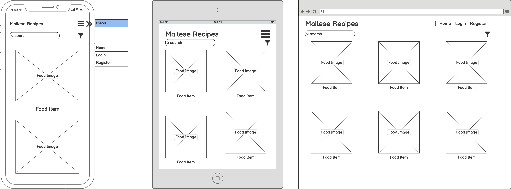
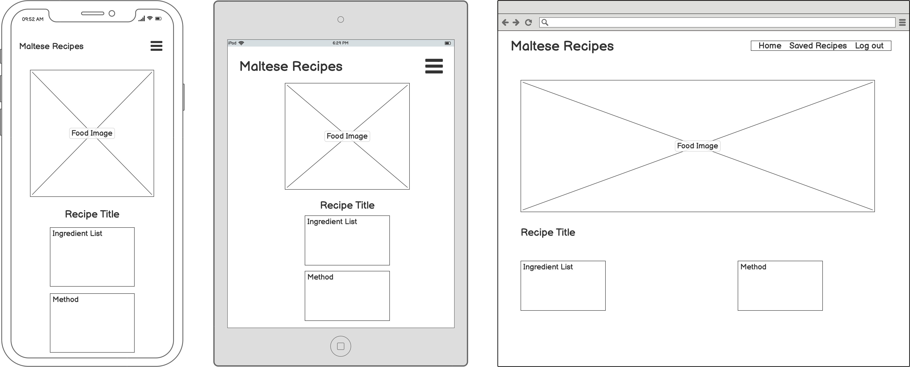
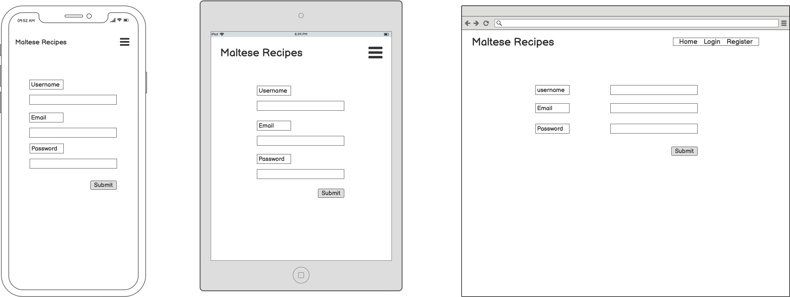
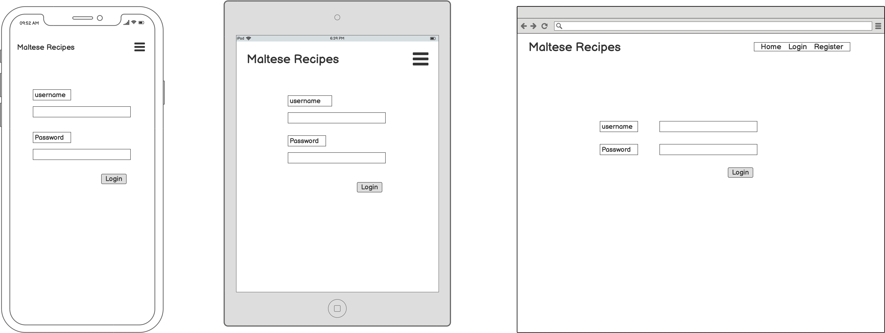
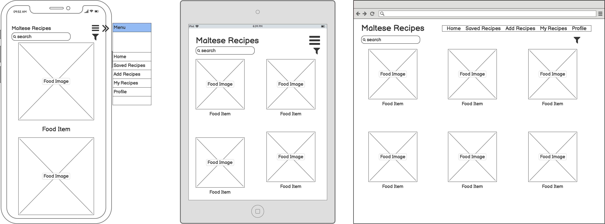
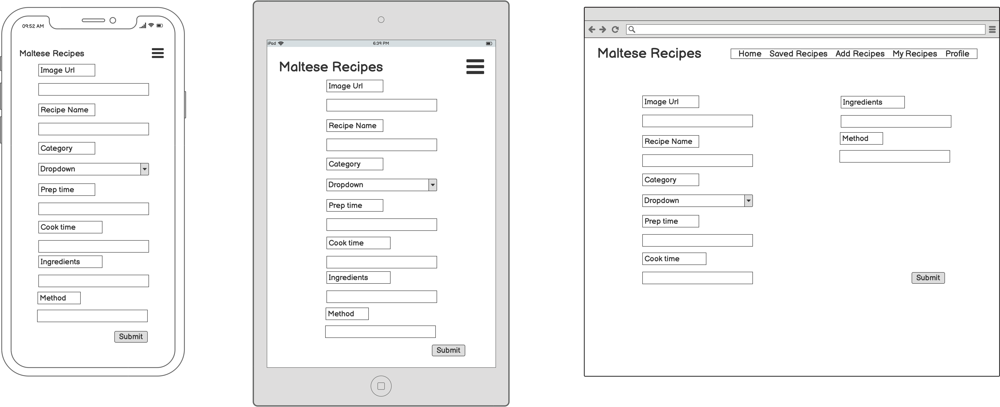
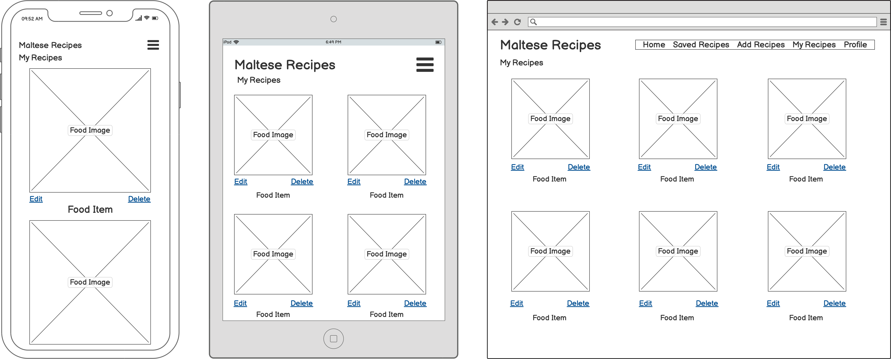
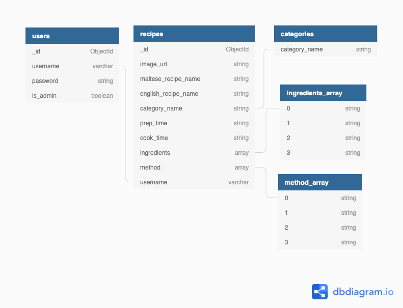

# Maltese Recipes

The aim of this project is to have a collection of Maltese recipes in one place. Users will be able to view recipes, register and login, save and add recipes and logout.

## <ins> Contents </ins>
1. UX
    * Project Goals
    * Customer Goals
    * Business Owner Goals
    * Developer Goals
    * User Stories
    * Design Choices
    * Wireframes
      
2. Features
3. Database Design
4. Technologies used
5. Testing
6. Deployment
7. Credits
    * Content
    * Code
    * Acknowledgements

## 1. UX

### Project Goals

The main aim of this project is to have a collection of Maltese recipes in one place. The website will also be a place where users can also add their own recipes and share recipes between them.

### Customer Goals

The target audience for this project are Maltese people and people who are interested in learning about Maltese cuisine.

Customer's goals are:

- to find recipes to use
- to search through recipes
- to add their own recipes
- to access the recipes they created

### Developer Goals

- To create a beautiful, elegant website that provides great user experience.
- to have a responsive website that works well on various mediums.

### User Stories

As a customer I want:

- to be able view recipes
- to be able to create an account where I can add recipes.
- to be able to log into my account.
- to be able to add new recipes.
- to have my recipes all in one place.

### Design Choices

The design is very simple, as I wanted to keep the focus on the recipes.
Since it is a Maltese recipe I wanted to use colour elements that represented Malta.
The luzzu(image below) is a traditional Maltese boat. Picking colours from that image felt appropriate for this website.

### Wireframes

Logged out user:

Home

- 

Individual Recipes

- 

Register
- 

Login
- 

Logged in user:

Home
- 

Individual Recipes
- 

Add recipes
- 

My Recipes
- 

## 2. Features

- Each page has a responsive fixed menu, a nav bar for medium and large pages and a sidenav for mobile.
- The homepage has a collection of all recipes from all users.
- There's a login/register page available for non-users.
- For users, they have an add recipe page and a my recipes where they can access all their added recipes.
- They can also log out.

* Features to implement in the future

- In the future I would like to add a save function and a saved recipes page.
- I would like to have a copy recipe function.

## 3. Database Design

- 

## 4. Technologies used

### Languages Used

- HTML5
- CSS3
- Javascript
- Python
- Jinja

### Frameworks, Libraries and Programs used

- Materialize
- Flask
- jQuery
- Git
- Github
- MongoDB
- Heroku
- dbdiagram
- Werkzeug

### Wireframes
- Balsamiq

## 5. Testing
## 6. Deployment and Cloning

To view the deployed version of this website:

### Github

- Click on the Maltese recipe repository in Github.
- Click on the Code button, and copy the url.
- Go to your local workspace and open a new terminal.
- Type git clone and paste the link copied and press enter.

### MongoDB Configuration

- Login to your MongoDB Account.
- From Clusters tab, click on Connect
- Select Connect to your application
- Select Python as Driver and choose Version 3.6 or later
- Create a new env.py file in your project, paste and save the connection link and variables.

- Create an instance of PyMongo:
mongo = PyMongo(app)

### Heroku Deployment

- Before deploying the project, create a requirements.txt file by running the following command in the CLI:

    pip3 freeze --local > requirements.txt

- Create a Procfile
- Log in to Heroku
- Select New on the dashboard and then Create new app
- Name your application, select the region, and then click Create app
- From the app dashboard, navigate to Deploy tab.
- From Deployment method Click on Github and click Search then select the repository name and click connect.
- Once connected click on Settings tab > Reveal Config Vars and add configuration variables to Heroku.
- Navigate to Deploy tab, and from Manual deploy choose master branch, and click Deploy Branch and enable automatic deploys.
Site is successfully deployed, and any futher changes on the app will automatically be updated everytime they are committed and pushed on Github.

## 7. Credits

### Content

Links to recipes:
https://www.ilovefood.com.mt/recipes/biskuttini-tal-lews-morr/
http://partaste.com/worldrecipes/imqarrun-il-forn-maltese-baked-macaroni-casserole/
https://www.deliciousmagazine.co.uk/recipes/ottijiet-maltese-spice-biscuits/

### Code

- Code to add input fields dynamically: https://bootstrapfriendly.com/blog/dynamically-add-or-remove-form-input-fields-using-jquery/
- General help from the Code Institute tasks project.
