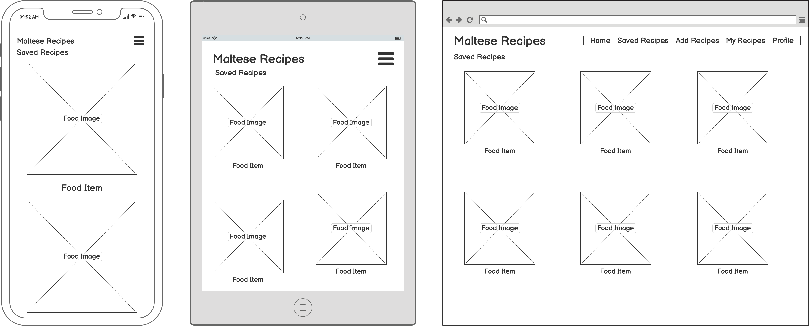
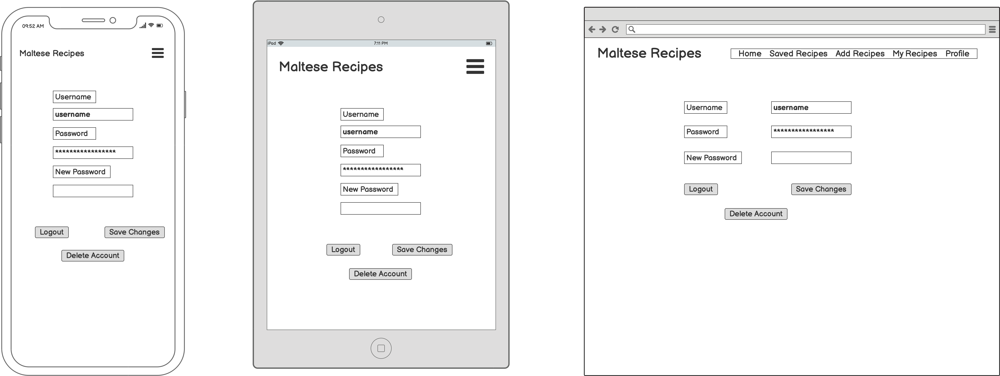

# Maltese Recipes

The aim of this project is to have a collection of Maltese recipes in one place. Users will be able to view recipes, register and login, save and add recipes and logout.

## <ins> Contents </ins>
1. UX
    * Project Goals
    * Customer Goals
    * Business Owner Goals
    * Developer Goals
    * User Stories
    * Design Choices
    * Wireframes
      
2. Features
3. Database Design
4. Technologies used
5. Testing
6. Deployment
7. Credits
    * Content
    * Code
    * Acknowledgements

## 1. UX

### Project Goals

The main of this project is to have a collection of Maltese recipes in one place. The website will also be a place where users can also add their own recipes and share recipes between them.

### Customer Goals

The target audience for this project are Maltese people and people who are interested in learning about Maltese cuisine.

Customer's goals are:

- to find recipes to use
- to save recipes for future reference
- to add their own recipes

### Developer Goals

- To create a beautiful, elegant website that provides great user experience.
- to have a responsive website that works well on various mediums.

### User Stories

As a customer I want:

- to be able view new recipes
- to be able to create an account where I can save recipes I like.
- to be able to add new recipes

### Design Choices

### Wireframes

Logged out user:

Home

- 

Individual Recipes

- 

Register
- 

Login
- 

Logged in user:

Home
- 

Saved Recipes
- 

Individual Recipes
- 

Add recipes and/or copy recipes
- 

My Recipes
- 

Profile
- 

## 2. Features

## 3. Database Design

- 

